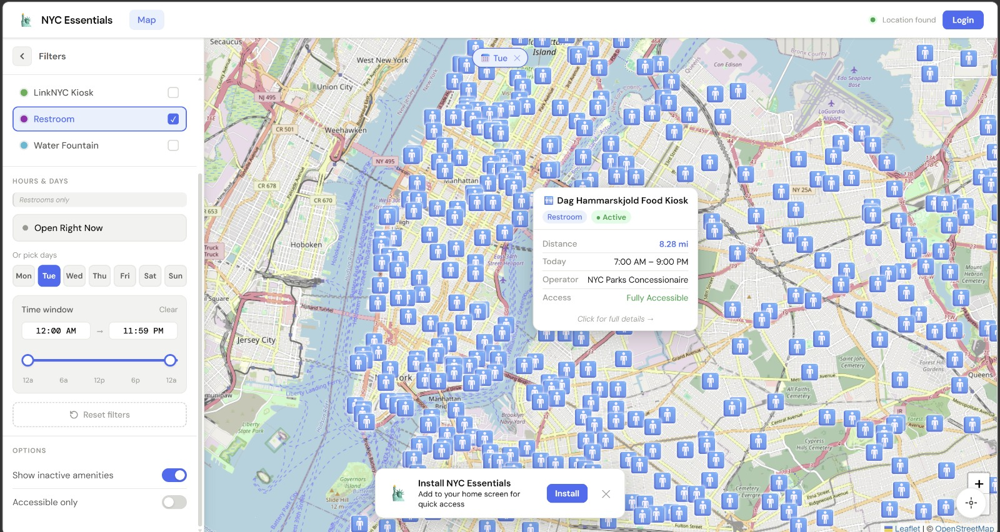
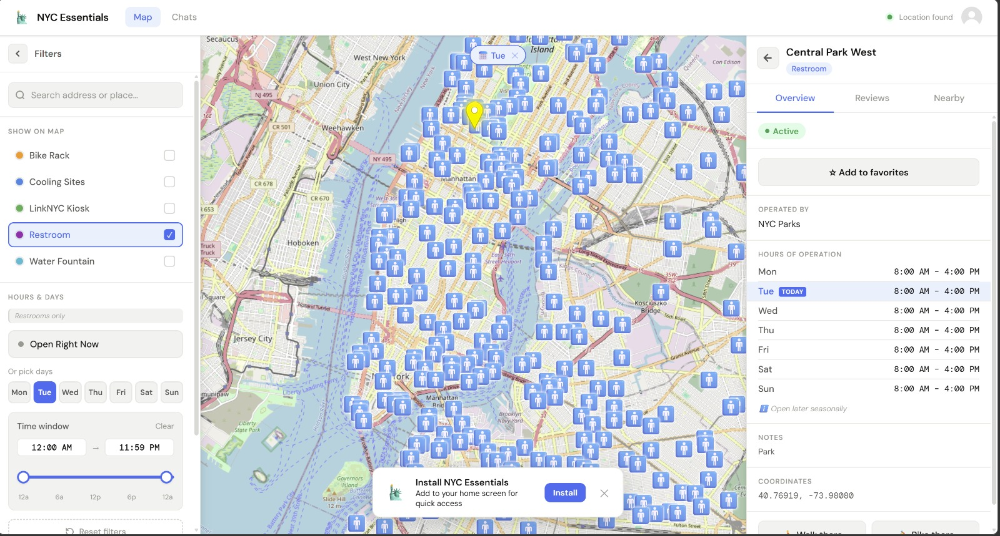
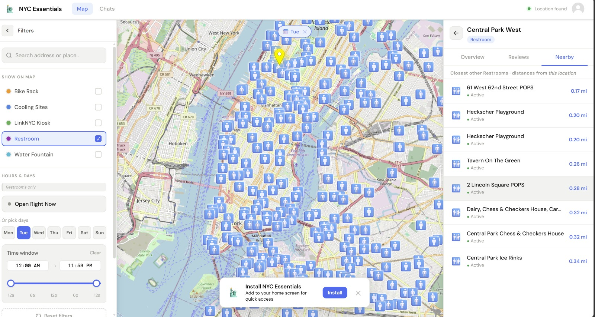

# Essentials NOW NYC

## Overview

Essentials NOW NYC is a spatial urban exploration system designed to help users locate essential public amenities in New York City, including restrooms, water fountains, Wi-Fi hotspots, and seating areas.

The system supports different user groups such as residents, students, commuters, and delivery workers who need quick and reliable access to essential infrastructure in urban environments.

It uses NYC Open Data to enable map-based discovery and interaction with city amenities.

---

## 👥 Users

* Residents — find nearby amenities and leave reviews  
* Students — locate study-friendly spaces and Wi-Fi  
* Commuters — plan multi-stop routes  
* Delivery workers — identify rest and utility points  

---

## 🗺️ Features

* Interactive map-based amenity exploration  
* Search by location, address, or landmark  
* Filters for amenity type and accessibility  
* Ratings and reviews for reliability  
* Favorites and saved locations  
* Chat and notification system (prototype)

---

## ⚡ Key Interactions

### 🌍 Translation Support
Multi-language support for amenity details and user reviews to improve accessibility.

### 🟢 Real-Time Availability
Users can mark amenities as:
* Available (✔)
* Not available (✖)

Status persists for 3 hours before resetting.

### ♿ Accessibility Filters
Filter amenities based on accessibility features such as wheelchair access and step-free entry.

### 🔔 Notifications
Users receive updates for:
* Chat messages
* Favorite location changes
* Availability updates

### 🚶 Navigation
One-click “Walk There” or “Navigate” opens Google Maps directly from the app.

---

## 🧭 System Design

* Spatial Layer: NYC Open Data + map visualization  
* Interaction Layer: search, filters, navigation  
* Feedback Layer: ratings, availability, user input  

---

## 🖼️ Screenshots

---

## 🧠 Notes

This project focuses on spatial interaction design, urban accessibility, and visual exploration of city infrastructure using real-world data.
